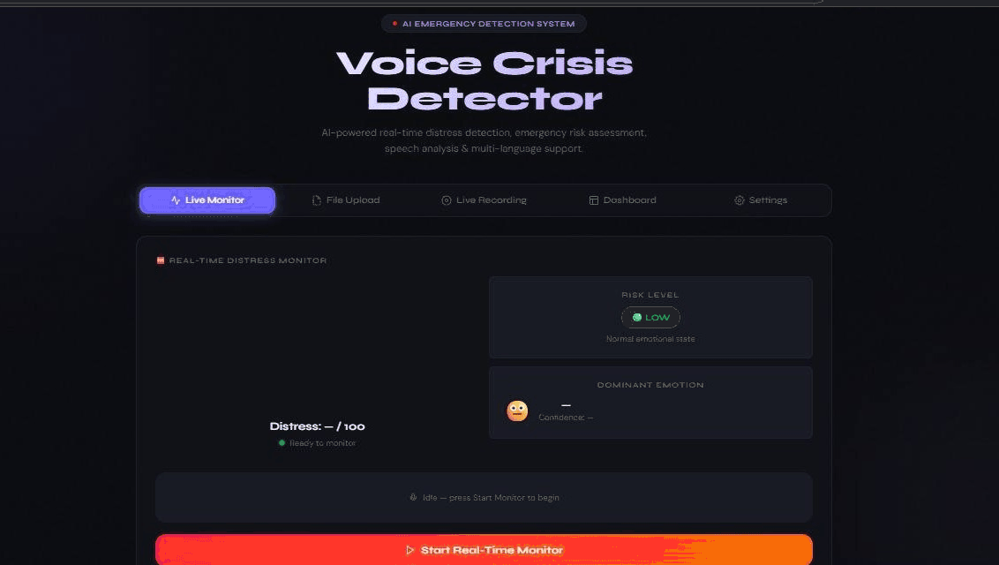

# DeepEmotion AI - Voice Emotion Detector

DeepEmotion AI is a real-time voice emotion detection and distress alert
system built with Python, Flask, TensorFlow/Keras, Librosa, Whisper, and
Chart.js.

## Description / Overview

This project analyzes speech audio to detect the speaker's likely emotion,
estimate a distress score, and show emergency-style risk alerts in a web
dashboard.

It supports uploaded audio files, live microphone recordings, and a live
monitoring mode. The app is useful for academic demos, machine learning
experiments, and prototype safety dashboards.

Important: this is a support and research tool. It should not be used as a
replacement for professional medical, mental health, or emergency services.

## Demo

Run the local demo after installation:

```bash
python app.py
```

Then open:

```text
http://localhost:5000
```



The interface includes these views:

- Live Monitor: real-time microphone monitoring with a distress gauge.
- File Upload: drag and drop an audio file for full analysis.
- Live Recording: record speech in the browser and analyze it.
- Dashboard: session history, emotion timeline, and risk distribution.
- Settings: model status, alert settings, and emergency contact references.

Replace the preview image with a real screenshot or GIF when you record the
running application.

## Installation

### 1. Clone the repository

```bash
git clone https://github.com/DataWhizMishra/Voice-Based-Emotion-Detector.git
cd Voice-Based-Emotion-Detector
```

### 2. Install Python

Use Python 3.10 or newer. Python 3.11 is recommended for this project.

Check your installation:

```bash
python --version
```

On some Windows systems, use:

```bash
py --version
```

### 3. Create a virtual environment

Windows:

```bash
python -m venv .venv
.venv\Scripts\activate
```

macOS / Linux:

```bash
python3 -m venv .venv
source .venv/bin/activate
```

### 4. Install dependencies

```bash
pip install --upgrade pip
pip install -r requirements.txt
```

### 5. Install FFmpeg

FFmpeg is required to convert browser recordings and uploaded audio formats
into WAV before analysis.

Windows:

```bash
winget install Gyan.FFmpeg
```

macOS:

```bash
brew install ffmpeg
```

Linux:

```bash
sudo apt install ffmpeg
```

### 6. Add or train the emotion model

The app expects the trained model at:

```text
models/Emotion_Voice_Detection_Model.h5
```

If the model file is missing, the app still opens in demo mode, but the
emotion predictions are simulated.

To train the model, download the RAVDESS speech dataset and run:

```bash
python model_trainer.py path/to/RAVDESS
```

The trainer extracts 40 MFCC features, applies scaling, trains a Conv1D CNN,
and saves the model into the `models/` folder.

## Usage

### Start the web app

```bash
python app.py
```

Open the browser at:

```text
http://localhost:5000
```

### Analyze an audio file in the UI

1. Open the File Upload tab.
2. Drop or choose a supported audio file.
3. Click Full Analysis.
4. Review the detected emotion, confidence, distress score, waveform,
   spectrogram, and risk level.

Supported formats:

```text
WAV, MP3, OGG, FLAC, M4A, WEBM
```

### Record live audio

1. Open the Live Recording tab.
2. Allow microphone access in the browser.
3. Record at least one second of speech.
4. Click Analyze Recording.

### Use the REST API

Check app status:

```bash
curl http://localhost:5000/api/status
```

Analyze an audio file:

```bash
curl -X POST -F "audio=@sample.wav" http://localhost:5000/api/analyze/full
```

Get session summary:

```bash
curl http://localhost:5000/api/session/summary
```

Clear session history:

```bash
curl -X POST http://localhost:5000/api/session/clear
```

## Features

- Detects 8 emotions: neutral, calm, happy, sad, angry, fearful, disgust,
  and surprised.
- Computes a 0-100 distress score from emotion probabilities.
- Maps distress into low, medium, high, and critical risk levels.
- Supports file upload, live recording, and real-time monitoring modes.
- Generates waveform and mel spectrogram visualizations.
- Shows confidence scores, top predictions, and all emotion probabilities.
- Tracks session history with dashboard charts and distributions.
- Detects emotional escalation across recent predictions.
- Supports speech-to-text with Whisper when available.
- Adds sentiment analysis and hidden distress keyword detection.
- Triggers browser-style emergency alerts for high and critical risk.
- Provides REST API endpoints for status, prediction, distress, sessions,
  alerts, and visualizations.
- Falls back to demo mode when no trained model is available.

## Tech Stack / Built With

- Python
- Flask
- Flask-CORS
- TensorFlow / Keras
- Librosa
- NumPy
- SciPy
- scikit-learn
- SoundFile
- Joblib
- OpenAI Whisper
- Hugging Face Transformers
- PyTorch
- Matplotlib
- HTML, CSS, and JavaScript
- Chart.js
- Web Audio API
- FFmpeg
- FPDF

## Contributing

Contributions are welcome.

To contribute:

1. Fork the repository.
2. Create a new branch.
3. Make your changes with clear commit messages.
4. Test the app locally before opening a pull request.
5. Describe what changed and how it was tested.

Please avoid committing generated files such as `__pycache__/`, temporary
audio uploads, local virtual environments, or downloaded datasets.

## License

No license file is currently included in this repository.


## Credits / Acknowledgments

- RAVDESS dataset for emotional speech samples.
- TensorFlow/Keras for the Conv1D emotion classification model.
- Librosa for audio loading and MFCC feature extraction.
- OpenAI Whisper for speech-to-text support.
- Hugging Face Transformers and CardiffNLP for sentiment analysis.
- Chart.js for dashboard and timeline visualizations.
- Flask for the web backend.
